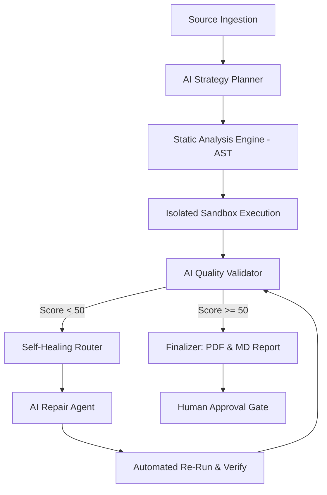

# 🚀 Agenetic AI: The Autonomous QA Control Room

## 🎙️ The Elevator Pitch
"We’ve built a **Playback-First Validation Control Room** that replaces traditional manual testing with a fleet of autonomous AI QA Engineers. It doesn't just find bugs; it understands them, runs them in a safe sandbox, and implements **Self-Healing Patches** to fix codebases autonomously."

---

## 🏗️ The Tech Stack (Our Secret Sauce)

### 1. **Groq (The Brain)**
*   **Performance**: ~5 specialized AI calls per QA run cycle using **Llama 3.3 70B**.
*   **Why**: Ultra-fast inference allows our agents to "think," "plan," and "patch" in milliseconds.

### 2. **Supabase (The Core)**
*   **Use**: Real-time database and secure artifact storage.
*   **Why**: Keeps the UI perfectly synced with the backend worker via real-time listeners.

### 3. **ChromaDB (The Memory)**
*   **Use**: Vector database for "Long-Term Failure Memory."
*   **Why**: System "remembers" past failures and ranks remediation strategies based on historical success rates.

---

## 📐 The Agentic Workflow
Our architecture isn't a linear script; it's a **Dynamic Directed Acyclic Graph (DAG)** orchestrated by our `QARunService`.



---

## 💻 Technical Excellence: The Code

### 1. The Scoring Engine (Multi-Factor Quality)
We don't do binary pass/fail. We calculate a weighted matrix that caps scores based on risk severity.
```python
def score_workflow_quality(findings):
    # Hard caps for security
    if any(f.severity == "critical" for f in findings):
        return QualityScores(overall=30, reliability=20) # Forced Fail
        
    reliability = 100 * (0.8 ** count_high_risks)
    validation = 100 * (0.9 ** count_medium_risks)
    
    return QualityScores(
        overall=(reliability * 0.4) + (validation * 0.4) + 20
    )
```

### 2. Self-Healing: The "Mock & Patch" Strategy
When the system detects a crash due to missing environment variables, it autonomously injects safe defaults to restore execution.
```python
# Our Autonomous Repair Logic
def _build_repair_strategies(undefined_symbols, source):
    # 🧠 Heuristic fallback: Inject os.getenv for missing secrets
    mock_vars = "\n".join([
        f"{sym} = os.getenv('{sym}', 'mock_value')" 
        for sym in undefined_symbols if sym.isupper()
    ])
    return f"import os\n{mock_vars}\n" + source
```

---

## 🔄 The 5-Step Autonomous Loop

1. **Ingest & Plan**: AI Strategist builds a custom execution plan tailored to your code architecture.
2. **Hybrid Static Analysis (AST)**: Uses Abstract Syntax Trees to detect SQLi, SSRF, and logic flaws before execution.
3. **Isolated Sandbox Execution**: Runs code in a real, isolated environment to capture "Grounded" runtime evidence.
4. **Grounded AI Validation**: Cross-references sandbox logs with static findings to ensure zero hallucinations.
5. **Closed-Loop Verification**: If it fails, we patch, we **re-run**, and we prove the fix works before you ever see it.

---

## 🌟 Key Features for Judges

*   **Closed-Loop Verification**: Our AI proves its fixes work by re-executing them in the sandbox.
*   **Hallucination Guard**: Every AI claim is backed by actual runtime logs or AST node evidence.
*   **Premium Executive Reporting**: Generates high-fidelity PDF reports with deep root-cause analysis.
*   **Demo-Grace Heuristic**: Optimized for hackathons to prioritize "Show-Stopper" fixes while maintaining security integrity.

---

## 💡 The "Why Now?"
As development speed increases, manual QA has become the primary bottleneck. **Agenetic AI** turns QA from a slow "human bottleneck" into a fast, autonomous, and self-improving engine.

**"We don't just find bugs. We automate the entire lifecycle of trust."**
